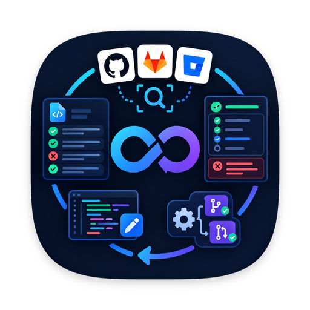
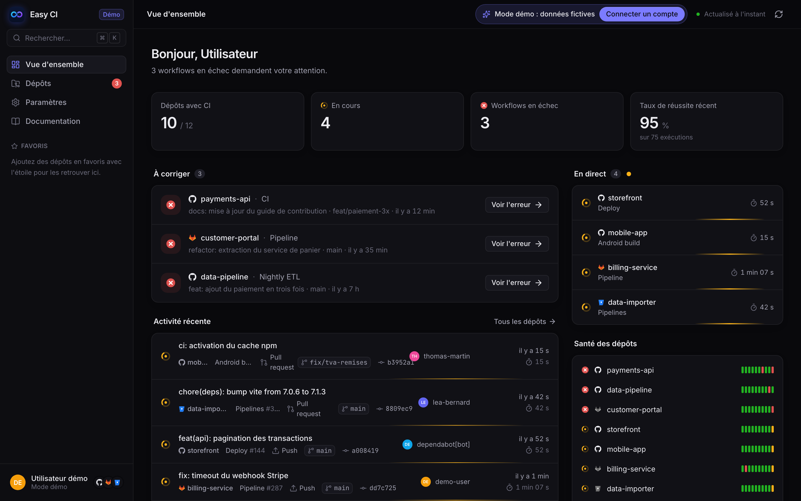
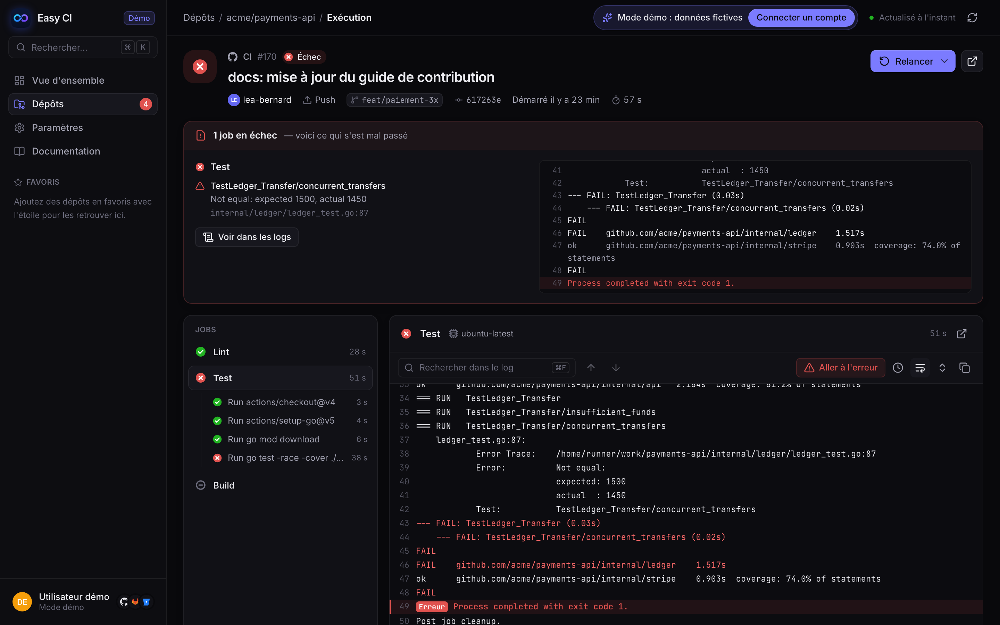
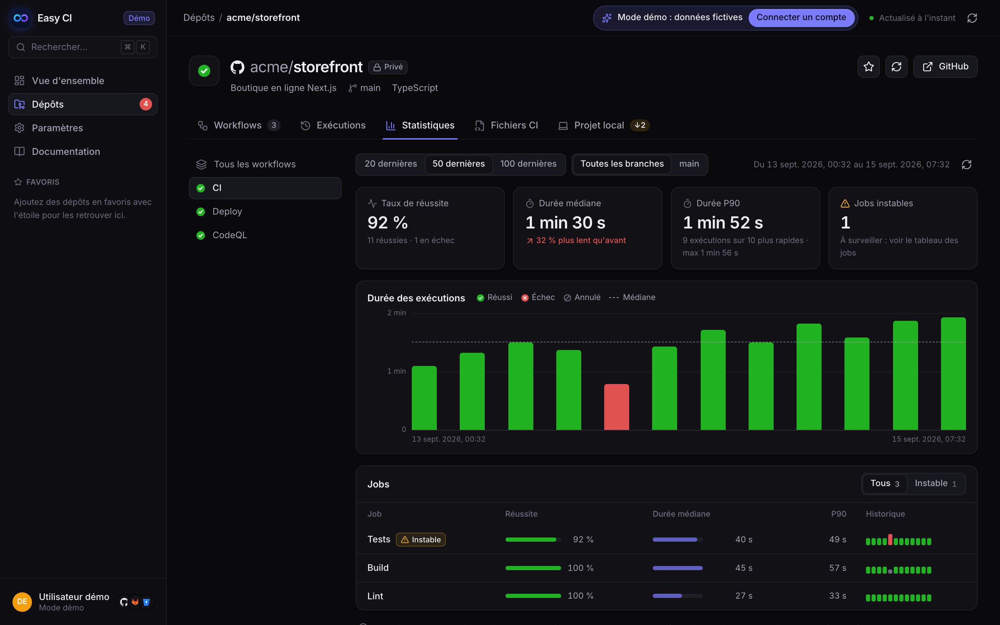

<p align="center">
  
</p>

<h1 align="center">Easy CI</h1>

<p align="center">
  <strong>Superviser, corriger, modifier et générer vos pipelines CI/CD — GitHub Actions, GitLab CI/CD et Bitbucket Pipelines — depuis une seule application desktop, rapide et native.</strong>
</p>

<p align="center">
  <a href="https://easy-ci.netlify.app"><strong>Site web</strong></a> ·
  <a href="https://easy-ci.netlify.app/demo"><strong>Démo en ligne</strong></a> ·
  <a href="https://easy-ci.netlify.app/download">Télécharger</a> ·
  <a href="README.md">🇬🇧 Read in English</a>
</p>

<p align="center">
  <a href="https://github.com/rodolphe37/easy-ci/actions/workflows/ci.yml"></a>
  <a href="https://github.com/rodolphe37/easy-ci/actions/workflows/package.yml"></a>
  <a href="https://github.com/rodolphe37/easy-ci/releases/latest"></a>
  <a href="LICENSE"></a>
  
</p>

<p align="center">
  <a href="pyproject.toml"></a>
  <a href="frontend/package.json"></a>
  <a href="https://github.com/astral-sh/ruff"></a>
  <a href="CONTRIBUTING.md"></a>
  
</p>

<p align="center">
  
</p>

---

## Sommaire

- [Pourquoi Easy CI ?](#pourquoi-easy-ci-)
- [Fonctionnalités](#fonctionnalités)
- [Plateformes prises en charge](#plateformes-prises-en-charge)
- [Installation](#installation)
- [Premiers pas](#premiers-pas)
- [Confidentialité et sécurité](#confidentialité-et-sécurité)
- [Stack technique](#stack-technique)
- [Développement](#développement)
- [Feuille de route](#feuille-de-route)
- [Contribuer](#contribuer)
- [Licence](#licence)

## Pourquoi Easy CI ?

Vos pipelines sont éparpillés : GitHub Actions pour certains projets, GitLab CI/CD au travail, Bitbucket Pipelines pour un client. Savoir *quel* pipeline est rouge, *pourquoi* et *comment* le corriger oblige à jongler entre les onglets, à parcourir des milliers de lignes de log et à modifier du YAML à l'aveugle.

Easy CI rassemble tout cela dans une application desktop : tous les pipelines de tous vos dépôts, les statuts en direct, des logs qui sautent directement à l'erreur, un éditeur YAML qui valide pendant la frappe et un assistant qui écrit un pipeline complet adapté à votre stack. Les modifications se font dans **votre clone local**, sont commitées sur une branche, puis envoyées ou proposées en pull request **uniquement quand vous le décidez**.

<p align="center">
  
</p>

## Fonctionnalités

### Superviser

- **Toute votre CI au même endroit** — GitHub Actions, GitLab CI/CD (gitlab.com et auto-hébergé) et Bitbucket Pipelines, un compte par plateforme.
- **Découverte automatique** de tous les dépôts et pipelines accessibles ; ajout d'autres dépôts par `owner/nom` ou URL, masquage, favoris.
- **Statuts en direct** — exécutions en cours actualisées toutes les quelques secondes, historique coloré, taux de réussite et santé des dépôts.
- **Notifications système** quand un pipeline échoue ou repasse au vert — natives sur macOS, Windows et Linux, pour tous les dépôts ou seulement vos favoris.
- **Statistiques des exécutions** dans le temps — taux de réussite, durées médiane et P90 avec leur tendance, et **jobs instables** (« flaky ») repérés quand ils échouent puis réussissent sur le même commit.

### Diagnostiquer

- **Détail d'une exécution** — jobs (par stage sur GitLab), étapes, durées, commit et auteur.
- **Logs lisibles** — couleurs ANSI, sections repliables, recherche, horodatage, affichage virtualisé des très gros logs, **logs en direct** sur GitLab et Bitbucket.
- **Analyse des échecs** — annotations et tests en échec (GitHub, GitLab), extrait autour de l'erreur et saut en un clic à la ligne fautive.
- **Actions** — relancer tout ou seulement les jobs en échec (selon la plateforme), annuler, ouvrir sur la plateforme.

### Travailler en local

- **Projets locaux** — détection des clones Git dans vos dossiers de projets, liaison au dépôt distant (ou clonage), branche, commits à récupérer ou à envoyer, état de chaque fichier CI.
- **Synchronisation sûre** — `git fetch` manuel ou automatique, mises à jour en avance rapide uniquement, sans jamais toucher au travail en cours ; ouverture dans le Finder/l'Explorateur, votre éditeur (VS Code, Cursor, Zed, JetBrains…) ou un terminal.

### Modifier

- **Éditeur YAML** (CodeMirror 6) avec suggestions des mots-clés de la plateforme, recherche, repli et **validation en direct** propre à chaque plateforme — erreurs soulignées dans le texte, et **CI Lint officiel de GitLab** à la demande.
- **Aperçu des jobs** et **diff** avec la branche distante ; protection contre les modifications externes et les pertes non enregistrées.
- **Publication maîtrisée** — commit local sur une branche dédiée, puis envoi et pull/merge request **uniquement sur action explicite**.

### Générer

- **Assistant de pipeline** — analyse le clone local et génère un pipeline complet : installation, lint, vérification des types, tests, build, matrice de versions, cache, déclencheurs, image Docker et déploiement (modèles Netlify, Vercel, Fly.io, Cloudflare, Render, Firebase, Serverless).
- **Stacks** : Node.js (npm, pnpm, Yarn, Bun), Python (pip, uv, Poetry, Pipenv), Go, Rust, Java/Kotlin (Maven, Gradle), Android, PHP, Ruby, .NET — monorepos compris.
- **Modèles déterministes, sans IA** — mêmes choix, même fichier ; rien n'est envoyé à un service tiers. L'aperçu YAML est validé en direct.

### Application desktop

- **Installation en une commande** sur macOS, Linux et Windows, avec **détection des nouvelles versions** et la commande de mise à jour adaptée à votre installation.
- **Mode démo** pour tout essayer sans compte, aussi disponible en [démo en ligne dans le navigateur](https://easy-ci.netlify.app/demo) (sur ordinateur), palette de commandes (`⌘K` / `Ctrl+K`), thèmes clair et sombre, **documentation intégrée**.
- **Interface en français et en anglais**, selon la langue du système, avec un choix manuel dans *Paramètres › Apparence*.

<p align="center">
  
</p>

## Plateformes prises en charge

| Fonctionnalité | GitHub Actions | GitLab CI/CD | Bitbucket Pipelines |
|---|:---:|:---:|:---:|
| Découverte, statuts, historique | ✅ | ✅ | ✅ |
| Jobs et logs | ✅ | ✅ | ✅ |
| Détail étape par étape | ✅ | — | — |
| Logs en direct pendant l'exécution | — | ✅ | ✅ |
| Annotations / rapports de tests | ✅ | ✅ | — |
| Tout relancer, annuler | ✅ | ✅ (nouveau pipeline) | ✅ (nouveau pipeline) |
| Relancer uniquement les jobs en échec | ✅ | ✅ | — |
| Validation pendant l'édition | ✅ | ✅ + CI Lint officiel | ✅ |
| Création de pull / merge request | ✅ | ✅ | ✅ |
| Génération de pipeline | ✅ | ✅ | ✅ |
| Notifications, statistiques des exécutions | ✅ | ✅ | ✅ |
| Jobs instables repérés sur les relances de jobs | ✅ | ✅ | — (relances du même commit) |
| Instances auto-hébergées | — (github.com) | ✅ | — (Bitbucket Cloud) |

## Installation

Easy CI est une application autonome : ni Python ni Node.js ne sont nécessaires, seulement **Git** pour les projets locaux. Les applications ne sont pas signées (certificats Apple Developer et Authenticode payants) : choisissez la méthode qui vous convient.

### macOS

Deux possibilités au choix :

```bash
# Option 1 : Homebrew — installation dans /Applications, mise à jour avec `brew upgrade`,
# mais clic droit › Ouvrir au premier lancement (application non signée).
brew trust --tap rodolphe37/easy-ci   # Homebrew 7+ demande d'approuver les taps tiers
brew tap rodolphe37/easy-ci
brew install --cask easy-ci
```

```bash
# Option 2 : script d'installation — aucun avertissement Gatekeeper (curl et ditto n'appliquent pas
# la quarantaine) ; relancer la même commande pour mettre à jour.
curl -fsSL https://raw.githubusercontent.com/rodolphe37/easy-ci/main/packaging/macos/install.sh | bash
```

### Linux

```bash
curl -fsSL https://raw.githubusercontent.com/rodolphe37/easy-ci/main/packaging/linux/install.sh | bash
```

Installe dans `~/.local/share/easy-ci`, crée la commande `easy-ci` et l'entrée du menu des applications. Mise à jour : relancer la commande ; désinstallation : `~/.local/share/easy-ci/install.sh --uninstall`. Linux x64 uniquement pour l'instant.

### Windows

Dans PowerShell :

```powershell
irm https://raw.githubusercontent.com/rodolphe37/easy-ci/main/packaging/windows/install.ps1 | iex
```

Installe dans `%LOCALAPPDATA%\Programs\EasyCI` avec un raccourci dans le menu Démarrer — sans droits administrateur ni écran SmartScreen. Relancer pour mettre à jour. Nécessite WebView2 (inclus dans Windows 10 et 11 à jour).

### Téléchargement manuel

Les archives de chaque version sont dans la [dernière Release](https://github.com/rodolphe37/easy-ci/releases/latest) : `EasyCI-macOS-ARM64.zip` (Apple Silicon), `EasyCI-macOS-X64.zip` (Intel), `EasyCI-Windows-X64.zip`, `EasyCI-Linux-X64.zip`, avec `SHA256SUMS.txt`.

Options des scripts (variables d'environnement) : `EASY_CI_VERSION=v0.2.0` pour une version précise, `EASY_CI_ARCHIVE=/chemin/EasyCI-….zip` pour installer une archive déjà téléchargée. Détails dans [`packaging/README.md`](packaging/README.md).

### Mises à jour

Easy CI vérifie au démarrage, puis toutes les 6 heures, si une version plus récente est publiée sur GitHub. Si c'est le cas, une fenêtre affiche les nouveautés et **la commande de mise à jour adaptée à votre installation** (Homebrew, script ou PowerShell). Une version peut être ignorée, et la vérification désactivée dans **Paramètres › Mises à jour**.

## Premiers pas

> [!TIP]
> Envie de voir avant d'installer ? La [démo en ligne](https://easy-ci.netlify.app/demo) exécute la vraie application (interface et moteur Python, via WebAssembly) dans votre navigateur, sur des données d'exemple, sans rien installer.

1. Lancez Easy CI et connectez une plateforme — ou cliquez sur **Explorer en mode démo** pour tout essayer avec des données simulées.
2. Créez un token avec les droits ci-dessous et collez-le (il est conservé dans le trousseau du système) :

   | Plateforme | Identifiants | Droits |
   |---|---|---|
   | GitHub | *Personal access token* (ou votre session GitHub CLI) | `repo`, `workflow`, `read:org` |
   | GitLab (gitlab.com ou auto-hébergé) | Adresse de l'instance + *personal access token* | `api`, `read_user` |
   | Bitbucket Cloud | E-mail Atlassian + API token, ou access token de workspace/dépôt | Lecture des dépôts et pipelines, écriture des pipelines |

3. Vos dépôts et pipelines apparaissent automatiquement. D'autres plateformes s'ajoutent à tout moment dans **Paramètres › Comptes**.
4. Pour modifier ou générer des fichiers CI, ouvrez l'onglet **Projet local** d'un dépôt et liez un dossier (Easy CI peut aussi parcourir vos dossiers de projets ou cloner le dépôt).

La **Documentation** intégrée (barre latérale) détaille chaque fonctionnalité pas à pas, dont la création de chaque token.

## Confidentialité et sécurité

- **Les tokens restent sur votre machine**, dans le trousseau du système (Trousseau macOS, Gestionnaire d'identifiants Windows, Secret Service sous Linux), et ne sont envoyés qu'à la plateforme concernée.
- **Ni télémétrie, ni statistiques d'usage, ni IA.** Les statistiques des exécutions sont calculées sur votre machine à partir des données de vos plateformes. La seule autre requête réseau est la vérification anonyme des mises à jour auprès de l'API GitHub Releases, désactivable.
- **Rien n'est envoyé sans votre accord** — les modifications sont écrites dans votre clone local ; l'envoi et la pull request sont des actions distinctes et explicites.
- Les opérations Git utilisent **votre propre `git`**, avec vos identifiants et votre configuration.

Une vulnérabilité ? Merci de la signaler en privé : voir [SECURITY.md](SECURITY.md).

## Stack technique

| Couche | Technologies |
|---|---|
| Fenêtre desktop | [pywebview](https://pywebview.flowrl.com/) (Cocoa/WebKit sur macOS, Edge WebView2 sur Windows, Qt WebEngine sous Linux) |
| Backend | Python 3.11+, [httpx](https://www.python-httpx.org/), [keyring](https://github.com/jaraco/keyring), [PyYAML](https://pyyaml.org/), [platformdirs](https://github.com/platformdirs/platformdirs) |
| Interface | [React](https://react.dev/) + TypeScript, [Vite](https://vite.dev/), [Tailwind CSS](https://tailwindcss.com/), [TanStack Query](https://tanstack.com/query), [React Router](https://reactrouter.com/), [Radix UI](https://www.radix-ui.com/), [CodeMirror 6](https://codemirror.net/), [cmdk](https://cmdk.paco.me/), [Lucide](https://lucide.dev/), [i18next](https://www.i18next.com/) |
| Qualité | [pytest](https://pytest.org/), [Ruff](https://docs.astral.sh/ruff/), TypeScript strict |
| Empaquetage et livraison | [PyInstaller](https://pyinstaller.org/), GitHub Actions (tests sur 3 systèmes, constructions macOS arm64/x64, Windows, Linux), GitHub Releases, tap Homebrew |

L'organisation du code est décrite dans [docs/architecture.md](docs/architecture.md).

## Développement

Prérequis : **Python 3.11+**, **Node.js 20+**, **Git**.

```bash
git clone https://github.com/rodolphe37/easy-ci.git && cd easy-ci
python3 -m venv .venv
.venv/bin/pip install -e ".[dev]"
npm --prefix frontend ci
npm --prefix frontend run build
```

Lancer l'application :

```bash
.venv/bin/easy-ci
```

Avec rechargement à chaud — démarrer le serveur Vite, puis ouvrir la fenêtre desktop dessus :

```bash
npm --prefix frontend run dev
```

```bash
.venv/bin/easy-ci --dev --debug
```

Ou développer dans un navigateur (l'API Python est servie en local, Vite redirige `/api`), puis ouvrir http://localhost:5173 :

```bash
.venv/bin/python -m easy_ci.devserver
```

Vérifications exécutées par la CI :

```bash
.venv/bin/pytest
```

```bash
.venv/bin/ruff check src tests scripts packaging
```

```bash
npm --prefix frontend run typecheck
```

```bash
npm --prefix frontend run i18n:check
```

Sous Linux, pywebview a besoin de GTK (`python3-gi`, `gir1.2-webkit2-4.1`) ou de Qt (`pip install -e ".[qt]"`). La construction de l'application autonome et la publication des versions sont décrites dans [packaging/README.md](packaging/README.md).

## Feuille de route

Réalisé :

- [x] Supervision GitHub Actions : découverte, statuts, détail des exécutions, logs, analyse des échecs, relance et annulation
- [x] GitLab CI/CD et Bitbucket Pipelines, comptes multiples, logs en direct
- [x] Projets locaux : détection des clones, liaison, état Git, synchronisation, diff des fichiers CI
- [x] Édition des fichiers CI avec validation, commit local, envoi et pull request à la demande
- [x] Génération de pipelines selon la stack détectée
- [x] CI/CD du projet : tests sur 3 systèmes, applications autonomes, GitHub Releases, tap Homebrew
- [x] Installation en une commande et notification des nouvelles versions
- [x] Interface et documentation en français et en anglais (i18n)
- [x] Notifications système quand un pipeline suivi échoue ou repasse au vert
- [x] Statistiques des exécutions dans le temps (durées, jobs instables)

Prochaines idées — retours et contributions bienvenus :

- [ ] D'autres langues pour l'interface (contributions bienvenues : un catalogue JSON par langue)
- [ ] Nouvelles plateformes : Azure Pipelines, CircleCI, Gitea/Forgejo Actions
- [ ] Linux arm64, AppImage / Flatpak, paquet winget

Les [issues](https://github.com/rodolphe37/easy-ci/issues) permettent d'en discuter ou de prendre un sujet.

## Contribuer

Toutes les contributions sont bienvenues — signalements de bugs, corrections de documentation, traductions, nouveaux détecteurs de stack ou nouvelles plateformes. Consultez [CONTRIBUTING.md](CONTRIBUTING.md) pour démarrer ; ce projet applique un [code de conduite](CODE_OF_CONDUCT.md). Les évolutions sont listées dans le [journal des modifications](CHANGELOG.fr.md).

Besoin d'aide ? Voir [SUPPORT.md](SUPPORT.md).

## Licence

Easy CI est distribué sous [licence MIT](LICENSE). © 2026 Rodolphe Augusto.

GitHub, GitLab et Bitbucket sont des marques de leurs propriétaires respectifs ; Easy CI est un projet indépendant, sans lien avec eux.
